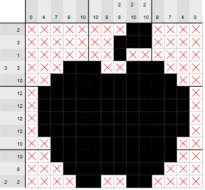

# Nonogram Foehn

A experimental project focused on solving Nonograms using a combination of traditional deductive algorithms and by a custom tokenized LLM setup, at the base revolving around the **Shakir Nonogram Notation (SNN)**.

## Vision
The goal of this project is to create techniques for Nonogram solving. While limited image-based standard solvers exist, this project introduces **SNN**, a FEN-style notation to enable a Large Language Model to input and solve puzzles as a string reasoning task rather than a coordinate-based matrix task.

## Key Components

### 1. The Shakir Nonogram Notation (SNN)
An attempt to build a string format that condenses puzzle clues and game states into a single, human readable line. 
> **See the full spec: [shakir_nonogram_notation.md](./shakir_nonogram_notation.md)**

### 2. SNN Parser & Utility
A core module to handle the conversion between SNN strings and 2D matrices.
* Support for Run-Length Encoding (RLE).
* Support for Column/Row multipliers.
* Error detection for invalid clues.

### 3. The Logic Algorithm
A high-performance solver utilizing:
* **Line Logic:** Deductive solving based on overlapping block possibilities.
* **Optimized Backtracking:** For resolving complex ambiguities in larger puzzles.

### 4. LLM Solver (Experimental)
The "Brain" of the project. We are in hope of training an LLM to utilize SNN state strings to perform logic steps. SNN's token efficiency allows us to provide the LLM with the entire puzzle state in a single prompt.

## Roadmap
- [x] Define SNN Specification 1.0.
- [ ] Build Python-based Parser.
- [ ] Implement Deductive Algorithm Engine.
- [ ] Develop Strategy.
- [ ] Release Web-based Solver Interface.
- [ ] more.
